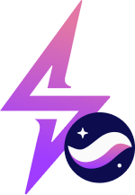

# StarkStorm



## TL;DR:

⚡️ StarkStorm is the P2P lending version of Stormbit on Starknet ⚡️

This is a peer-to-peer lending platform developed on Starknet. It allows borrowers to request loans and multiple lenders to fund the loans by specifying the amount they want to contribute.

StarkStorm, a product of Stormbit on the Starknet blockchain, addresses the need for a trust-based, modular, and highly customizable lending platform. StarkStorm offers decentralized and efficient P2P lending supported by robust off-chain data aggregation, targeting financial inclusion and offering better APYs than traditional banking systems.

## 🌐 Features

### 🔑 User Registration

- Enable users to register on the platform with their desired name
- Only registered users can use the platform

### 💸 Request Loan

- Borrowers can request a loan by specifying the token address, amount, interest, and deadline for allocation

### 💰 Fund Loan

- Lenders can view a list of loans and choose which to fund based on their preferences
- Funds are transferred directly to the borrower

### 💳 Repay Loan

- The platform does not restrict who can repay the loan; it can be the borrower or another user
- Repayment funds are automatically transferred back to lenders

## 🔧 Requirements

Before you begin, you need to install the following tools:

- [Node (>= v18.17)](https://nodejs.org/en/download/)
- Yarn ([v1](https://classic.yarnpkg.com/en/docs/install/) or [v2+](https://yarnpkg.com/getting-started/install))
- [Git](https://git-scm.com/downloads)

### 🛠️ Scarb version

To ensure the proper functioning of scaffold-stark, your local `Scarb` version must be `2.5.4`. To accomplish this, first check your local Scarb version:

```sh
scarb --version
```

If your local Scarb version is not `2.5.4`, you need to install it.

<details>
<summary><b>Scarb Installation Process</b></summary>

To install Scarb, please refer to the [installation instructions](https://docs.swmansion.com/scarb/download).
We strongly recommend that you install
Scarb via [asdf](https://docs.swmansion.com/scarb/download.html#install-via-asdf), a CLI tool that can manage
multiple language runtime versions on a per-project basis.
This will ensure that the version of Scarb you use to work on a project always matches the one defined in the
project settings, avoiding problems related to version mismatches.

Please refer to the [asdf documentation](https://asdf-vm.com/guide/getting-started.html) to install all
prerequisites.

Once you have `asdf` installed locally, you can download Scarb plugin with the following command:

```bash
asdf plugin add scarb
```

This will allow you to download specific versions. You can choose the same version as the Dojo's Cairo version, for example, 2.5.4, with the following command:

```bash
asdf install scarb 2.5.4
```

and set a global version:

```bash
asdf global scarb 2.5.4
```

Otherwise, you can simply run the following command in your terminal, and follow the onscreen instructions. This
will install the version `2.5.4` of Scarb.

```bash
curl --proto '=https' --tlsv1.2 -sSf https://docs.swmansion.com/scarb/install.sh | sh -s -- -v 2.5.4
```

</details>

### 🧪 Starknet Foundry version

To ensure the proper functioning of the tests on scaffold-stark, your Starknet Foundry version must be 0.23.0. To accomplish this, first check your Starknet Foundry version:

```sh
snforge --version
```

If your Starknet Foundry version is not `0.23.0`, you need to install it.

- [Starknet Foundry](https://foundry-rs.github.io/starknet-foundry/getting-started/installation.html)

## 📋 Compatible versions

- Scarb - v2.5.4
- Snforge - v0.23
- Cairo - v2.5.4
- Rpc - v0.5.1

## 🚀 Quickstart

To get started, follow the steps below:

1. Clone this repo and install dependencies

```bash
git clone https://github.com/bowbowzai/starkhack-p2p-lending.git
cd starkhack-p2p-lending
git clone https://github.com/0xSpaceShard/starknet-devnet-rs -b json-rpc-v0.5.1 packages/snfoundry/local-devnet
yarn install
```

1. Run a local network in the first terminal.

```bash
yarn chain
```

This command starts a local Starknet network using Devnet. The network runs on your local machine and can be used for testing and development. You can customize the network configuration in `scaffold.config.ts` for your nextjs app.

3. On a second terminal, deploy the sample contract:

```
yarn deploy --network {NETWORK_NAME} // when NETWORK_NAME is not specified, it defaults to "devnet"
```

**Note:** To use sepolia tesnet, you have to set {NETWORK_NAME} to `sepolia`.

This command deploys a sample smart contract to the local network. The contract is located in `packages/snfoundry/contracts/src`. The `yarn deploy` command uses the deploy script located in `packages/snfoundry/scripts-ts/deploy.ts` to deploy the contract to the network.

4. On a third terminal, start your NextJS app:

```
yarn start
```

Visit your app on: `http://localhost:3000`. You can interact with your smart contract using the `Debug Contracts` page. You can tweak the app config in `packages/nextjs/scaffold.config.ts`.
